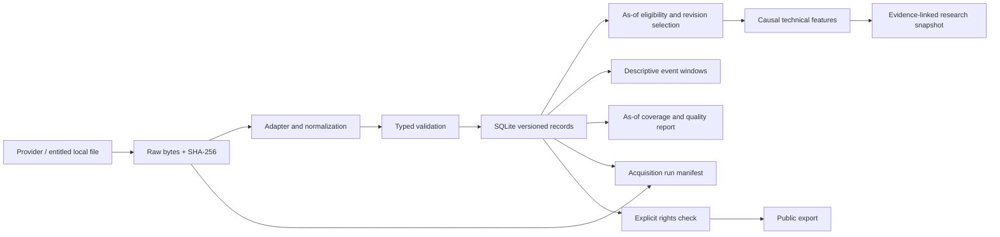

# Architecture

Release 0.19 adds `evidence_synthesis.py`: deterministic versioned rules consume an already verified report JSON, preserve exact values/sample/source identities and JSON evidence pointers, distinguish historical-vintage disagreements from current-revision differences, and expose qualitative uncertainty and non-comparability. The self-contained bundle stores its input and verifies hashes plus complete rule/prose recomputation. Existing research/comparison schemas stay unchanged. The read-only local UI derives a synthesis for each verified report at snapshot startup; filters alter presentation, while JSON export retains the same filtered findings with input and synthesis fingerprints. No probability, market direction or causal attribution is produced.

Release 0.18 adds independent version-1 runtime and transport evidence contracts. `runtime_evidence.py` binds an optional bundle-writer environment receipt to report bytes/fingerprint, with a separate hash manifest checked by the existing bundle verifier. Legacy report/comparison contracts stay unchanged. `transport_evidence.py` uses ContextVars to capture bounded `fetch_bytes` attempts and binds each sidecar to its finalized acquisition manifest; the loader checks chronology and scope. No URL/headers/body/exception payload is serialized. Quota stays unmeasured. These optional evidence files are outside the existing core backup scope. The local UI exposes checked runtime and new attempt histories. See [scope and live proof](source-methodology/runtime-transport.fa.md).

Release 0.17 adds a loopback-only read-only workspace: `local_ui.py` validates normalized-record hashes in a locked SQLite read snapshot, then closes SQLite and serves immutable in-memory series, inventory, verified historical research/comparisons and health evidence. Source/units/dimensions/vintages stay distinct; nulls remain null. Packaged HTML/CSS/JS draws charts and safe text/tables without external assets or browser calculations replacing research engines. GET endpoints are allowlisted with Host/Origin checks; arbitrary files and write/network actions are absent. `local_launcher.py` starts a hidden process and verifies its launch receipt before restart/stop. `project_roadmap.py` validates the shared phase source, also used by generated Persian documentation.

Release 0.16 adds `operations_health.py`: an offline, writer-coordinated snapshot of acquisition identities, latest statuses, failure streaks and unfinished traces. An explicitly supplied refresh adds safe error codes after operation/source/series/state/count checks; relocation is explicit and recorded. Quota and historical runtime remain unknown, while snapshot runtime is recorded. Request budgets accept only integers 1–3; no workflow retry or scheduler is added. See [operational health](source-methodology/operations-health.fa.md).

Current operational addition (0.15): `store_lock.py` coordinates Store initialization/raw/record writes, whole acquisition traces, refresh workflows and core-store backups with one nonblocking OS lock. `backup.py` uses SQLite's online backup API, preserves all raw and acquisition JSON, validates normalized/trace lineage and restores into a new isolated container. Direct SQL or external filesystem writers remain outside this protocol. Backup/restore contracts are independent version 1; existing research/refresh contracts remain unchanged. External reports, code/config and keys are separate recovery assets. See [store recovery](source-methodology/store-recovery.fa.md).

`src/gold_intelligence` groups actual code by responsibility: contracts (`models`), rights (`registry`), immutable raw/transactional normalization (`storage`), adapters (`ingestion`), operation manifests (`acquisition`), coverage checks (`quality`), scoped key loading (`credentials`), features and event research (`analysis`), market state (`snapshot`), and executable commands (`cli`). This replaces empty `ingestion/lbma`, `agents/*` and similar directories in the original sketch with an installable package. Future integrations belong here or in documented services when they exist.

## Storage and reproducibility

Default runtime path is `local/market`, ignored by Git. Raw filenames equal their SHA-256. SQLite rows contain a content hash ID, record kind and canonical JSON; input metadata and retrieval time form part of identity. Inserting the exact same record is idempotent. A later retrieval is a new provenance version; snapshot selection collapses price revisions by bar time. A conflicting same-time revision fails instead of selecting arbitrarily. One import validates the complete batch before a single database transaction. Failed imports may retain raw bytes for inspection but no partial normalized batch.

Logical zones are raw (original bytes), bronze (parsed provider records), silver (normalized contracts), gold (snapshots), derived (versioned features/research) and events (cited metadata). Release 0.5 materializes raw blobs, silver records and acquisition manifests in the local store; bronze parsing is in memory and snapshot/quality output is explicit. It does not operate a distributed lakehouse. Large data later moves to partitioned Parquet/object storage with manifest hashes and migrations.

CLI acquisition records start and terminal status with atomic manifest replacement. Store instrumentation captures raw hashes and normalized IDs, including exact duplicates, without serializing API keys or exception messages. A process crash can leave a `running` manifest; manifests and SQLite are not a distributed transaction. Quality checks inspect all stored record/raw integrity while computing coverage only from as-of eligible versions. Separate venue, contract, unit, vintage and source identities are not pooled to satisfy coverage. The [quality guide](quality-operations.md) defines the limits.

Each snapshot records every contributing price/observation record ID, feature version and parameters. IDs link to SQLite payloads, then raw hash and row locator, then source URL. `gold audit` verifies referenced bytes. Data and derived exports outside the repo must preserve these references and source rights. Feature configuration/code changes require a feature-version bump and regression checks.

## Current operational boundaries

Release 0.4 adds `macro.py` for metadata-gated FRED sets and point-in-time scalar selection, `world_bank.py` for read-only monthly gold ingestion, and `comparison.py` for a separate monthly diagnostic. Macro reference dates do not become release timestamps. Monthly gold is an `Observation` with a methodology dimension, not a `PriceClose` or `PriceBar`. `scripts/inspect_history.py` also reconciles workbook cells and verifies acquisition metadata hashes; the base `Store.audit` only checks bytes referenced by records. Batch FRED acquisition is atomic per series, not across the whole set.

Offline CI has no credentials. FRED, Alpha Vantage gold history and World Bank monthly gold are network adapters; bounded requests, finite response size and explicit errors keep failures visible. Alpha Vantage has its own module, `alpha_vantage.py`, and a separate date-only `PriceClose` contract. Its records never enter OHLC calculations. CFTC supports a local legacy CSV and the separate public disaggregated gold API in `cftc.py`. No cron service, broker, API server, LLM, vector store or dashboard is running. SQLite reads are intended for research-sized batches; scalable indexing/partitioning and a migration framework belong to later releases.

`release_calendar.py` ingests explicit reviewed timing notes into the existing calendar contract. It verifies source URLs, local offsets, raw-note hashes and as-of eligibility, then selects the newest captured schedule before applying the horizon. `brief.py` combines quality, macro and calendar outputs into a local Persian Markdown/JSON brief. It does not call a model, subscribe to a calendar, send notifications or rewrite observation availability. BLS original-file downloading is not claimed.

`monthly_research.py` selects current revisions known at an explicit cutoff, validates five compatible streams, aggregates complete months, and derives adjacent-month changes. It preserves the World Bank method break, missingness and common-sample membership through summary and rolling correlations. The Persian report and typed evidence JSON remain local. The run fingerprint binds software version, plan, cutoff and selected record IDs; `scripts/inspect_monthly_research.py` independently reconciles the reported arithmetic against SQLite inputs. This descriptive view is separate from historical-release replay and daily execution-price research.

`release_values.py` normalizes reviewed BLS archive values into separate macro observation series, retaining document number, header clock, capture and reissue status. It reconstitutes whole evidence bundles and selects the latest capture before comparing values with exact-date FRED vintages and current revisions. CPI headline changes require two index parents from the same vintage. The comparison verifies raw response vintage metadata, native units and row values; all parent IDs are included in the report. Original records and availability clocks remain immutable. BLS evidence hashes cover reviewed JSON extracts, not original HTML, and agreement does not promote an embargo clock to measured delivery.

`revision_ledger.py` adds a declared-window audit of the same reference period across adjacent headline documents. It shares whole-bundle integrity validation with `release_values.py`, retains all eligible capture versions, and chooses the latest entire capture per URL. Separate document slots expose absent or ambiguous candidates; the final planned period requires a following headline document. Pair values and native FRED vintage parents remain linked. Same-URL recaptures are reported separately from cross-document differences. The independent `scripts/inspect_revision_ledger.py` checks complete-ledger raw cells and rational arithmetic without importing either production calculation module. Report completeness never certifies first-release status or historical availability.

`research_report.py` orchestrates these engines without reimplementing their calculations. One explicit UTC cutoff and SQLite read transaction bind quality, macro, calendar, monthly, release-value and revision outputs. Price coverage is derived from quality streams. Release 0.12 adds COT as the eighth section, calculated inside the same database read snapshot. External raw files remain immutable hash-addressed evidence; they are checked but not database-snapshotted. A preexisting transaction is rejected without rolling it back. Integrity failures abort; normal absence can produce a partial report. No prior report files or network requests supply missing components.

The typed aggregate binds settings, registry hash, software version, child cutoffs and derived section states. Its semantic fingerprint excludes generation clocks but retains capture/retrieval times and selected evidence. The writer materializes thirteen files in schema 2 (eleven in schema 1) and a manifest under a unique `.incomplete-*` directory, verifies them, then renames within the output directory. Failed writes may retain the staging directory; prior runs and unlisted reader notes are preserved. This is a completed-bundle publication boundary, not a power-loss durability guarantee. `verify-report` needs only the bundle and checks byte hashes and JSON coherence; source authenticity and independent arithmetic require separate evidence. Large child reports are duplicated in the aggregate intentionally for a self-contained typed record; the database/raw store is not copied.

`report_comparison.py` consumes saved reports through `load_verified_report`, which returns the same bytes that passed manifest validation. Context differences cover cutoff, settings, software and registry. Semantic keys align streams, periods, methods, sample populations, documents and revision pairs without positional joins. Generation clocks and derived fingerprints are excluded from content differences; record-ID lists are sorted without erasing multiplicity. Duplicate row keys fail. Parent JSON pointers retain the original array locations, while projection separates collections from summaries to avoid counting their entire contents twice. Age and evidence fields are tagged, not causally explained.

Comparisons write four artifacts plus a manifest to a new directory after staging and verification. Two exact source JSON snapshots make `verify-comparison` independent of source paths and the database: it checks bytes and recomputes the typed comparison. Source bundle files beyond those JSON snapshots are not copied or re-audited later; the initial source-bundle verification remains a creation-time check. The comparison fingerprint excludes its generation clock and source locations, but binds input byte hashes and comparator/software versions. Markdown is a bounded view; JSON retains all differences. Price inventory is explicitly a coverage comparison, not a record-value inventory.

`cftc.py` captures metadata, count responses and bounded ordered pages, validates stable visible revision markers and full balances, then inserts one complete batch. Each positioning record references a hashed capture document linking the original raw parts; `Store.audit` checks the immediate capture hash, while `positioning_context` follows and reconciles the complete chain. `positioning.py` selects whole five-category report versions known at the cutoff and writes a separate Persian/JSON report. Its freshness policy uses observation-date age; historical release clocks remain unknown. Release 0.12 integrates this context into schema-2 reports and comparator-2 results while preserving the standalone command.

Schema dispatch happens before model validation: legacy report/settings/manifest models receive no COT defaults. Shared validators use each version's exact component/file set. New contexts validate date/category uniqueness, balances, nets, shares, seven-day deltas and freshness; unified reports also reconcile COT version/date counts to the quality inventory. Source-backed reconstruction happens during report building, while saved-bundle checks require no store. Comparator 2 only indexes COT entities when both source schemas contain that section; comparator 1 retains its original section set and context rules for exact recomputation. Comparison manifests remain version 1 because their file-set contract is unchanged.

`refresh.py` composes existing adapters and the report builder in a manual workflow. A nonblocking OS lock guards concurrent refresh workflows on one store; each source/series has a preassigned trace ID. Atomically replaced checkpoints distinguish pending, running, succeeded, failed and interrupted steps. FRED windows align with reviewed period frequency; COT uses an overlapping observation interval. Successful inserts survive another source's failure. After all attempts, a new cutoff is passed to the existing report builder and its output is verified. Freshness is projected from that exact report, preserving macro nulls and the World Bank method break. Safe reason codes never copy exception messages. The workflow JSON is an operational checkpoint, not an independently hashed research bundle or a resumable transaction log. Reviewed BLS notes and exact-date FRED vintages are explicit manual inputs. No background process is installed.

## تحویل ۰٫۲۰: بازیابی شواهد شبکه

پشتیبان نسخهٔ ۲ transport را همراه SQLite/raw/runs حفظ می‌کند؛ verify/restore نسخهٔ ۱ نیز پشتیبانی می‌شود. گزارش‌ها و ضمیمه‌ها خارج از دامنه‌اند. [دامنه و کنترل‌ها](source-methodology/transport-recovery.fa.md).
