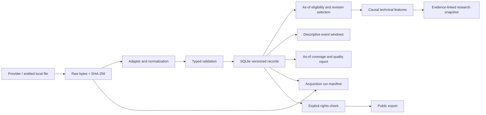

# Architecture

`src/gold_intelligence` groups actual code by responsibility: contracts (`models`), rights (`registry`), immutable raw/transactional normalization (`storage`), adapters (`ingestion`), operation manifests (`acquisition`), coverage checks (`quality`), scoped key loading (`credentials`), features and event research (`analysis`), market state (`snapshot`), and executable commands (`cli`). This replaces empty `ingestion/lbma`, `agents/*` and similar directories in the original sketch with an installable package. Future integrations belong here or in documented services when they exist.

## Storage and reproducibility

Default runtime path is `local/market`, ignored by Git. Raw filenames equal their SHA-256. SQLite rows contain a content hash ID, record kind and canonical JSON; input metadata and retrieval time form part of identity. Inserting the exact same record is idempotent. A later retrieval is a new provenance version; snapshot selection collapses price revisions by bar time. A conflicting same-time revision fails instead of selecting arbitrarily. One import validates the complete batch before a single database transaction. Failed imports may retain raw bytes for inspection but no partial normalized batch.

Logical zones are raw (original bytes), bronze (parsed provider records), silver (normalized contracts), gold (snapshots), derived (versioned features/research) and events (cited metadata). Release 0.5 materializes raw blobs, silver records and acquisition manifests in the local store; bronze parsing is in memory and snapshot/quality output is explicit. It does not operate a distributed lakehouse. Large data later moves to partitioned Parquet/object storage with manifest hashes and migrations.

CLI acquisition records start and terminal status with atomic manifest replacement. Store instrumentation captures raw hashes and normalized IDs, including exact duplicates, without serializing API keys or exception messages. A process crash can leave a `running` manifest; manifests and SQLite are not a distributed transaction. Quality checks inspect all stored record/raw integrity while computing coverage only from as-of eligible versions. Separate venue, contract, unit, vintage and source identities are not pooled to satisfy coverage. The [quality guide](quality-operations.md) defines the limits.

Each snapshot records every contributing price/observation record ID, feature version and parameters. IDs link to SQLite payloads, then raw hash and row locator, then source URL. `gold audit` verifies referenced bytes. Data and derived exports outside the repo must preserve these references and source rights. Feature configuration/code changes require a feature-version bump and regression checks.

## Current operational boundaries

Release 0.4 adds `macro.py` for metadata-gated FRED sets and point-in-time scalar selection, `world_bank.py` for read-only monthly gold ingestion, and `comparison.py` for a separate monthly diagnostic. Macro reference dates do not become release timestamps. Monthly gold is an `Observation` with a methodology dimension, not a `PriceClose` or `PriceBar`. `scripts/inspect_history.py` also reconciles workbook cells and verifies acquisition metadata hashes; the base `Store.audit` only checks bytes referenced by records. Batch FRED acquisition is atomic per series, not across the whole set.

Offline CI has no credentials. FRED, Alpha Vantage gold history and World Bank monthly gold are network adapters; bounded requests, finite response size and explicit errors keep failures visible. Alpha Vantage has its own module, `alpha_vantage.py`, and a separate date-only `PriceClose` contract. Its records never enter OHLC calculations. CFTC accepts an official locally acquired CSV. No cron service, broker, API server, LLM, vector store or dashboard is running. SQLite reads are intended for research-sized batches; scalable indexing/partitioning and a migration framework belong to later releases.

`release_calendar.py` ingests explicit reviewed timing notes into the existing calendar contract. It verifies source URLs, local offsets, raw-note hashes and as-of eligibility, then selects the newest captured schedule before applying the horizon. `brief.py` combines quality, macro and calendar outputs into a local Persian Markdown/JSON brief. It does not call a model, subscribe to a calendar, send notifications or rewrite observation availability. BLS original-file downloading is not claimed.
